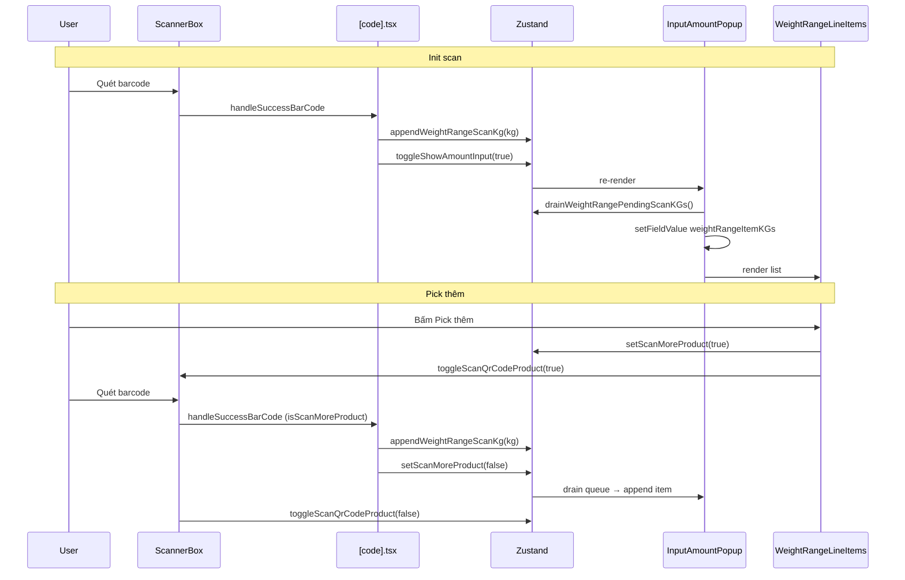

# Weight Range Pick — Expected Flow

Tài liệu mô tả luồng pick sản phẩm **WEIGHT_RANGE** (quét từng item theo KG) trong màn order-pick.

## Khái niệm

| Khái niệm                        | Ý nghĩa                                                             |
| -------------------------------- | ------------------------------------------------------------------- |
| **WEIGHT_RANGE**                 | Tag sản phẩm: mỗi lần quét = 1 item với trọng lượng KG riêng        |
| **weightRangeItemKGs**           | Mảng KG từng lần quét, ví dụ `[2.5, 2.6, 3.7]`                      |
| **pickedQuantity**               | Tổng KG = `sum(weightRangeItemKGs)`                                 |
| **orderQuantity** (weight range) | Số item cần pick theo đơn vị quy đổi (vd. 4 Bắp), **không phải KG** |
| **weightRangePendingScanKGs**    | Hàng đợi KG chờ form consume sau mỗi lần quét                       |

## Data model

### Form (Formik — `InputAmountPopup`)

```ts
{
  weightRangeItemKGs: number[];  // [2.5, 2.6, 3.7]
  pickedQuantity: number;        // 8.8 (auto = sum)
  pickedErrorType: string;
  pickedNote: string;
}
```

### Submit API (`pickedExtraQuantities`)

```ts
pickedExtraQuantities: {
  weightRangeItemKGs: [2.5, 2.6, 3.7];
}
pickedQuantity: 8.8; // tổng KG
```

### Store (Zustand — bridge scan → form)

```ts
weightRangePendingScanKGs: number[]   // queue, drain vào form
isScanMoreProduct: boolean            // true khi bấm "Pick thêm"
isShowAmountInput: boolean            // popup mở/đóng
currentId: number | null              // sản phẩm đang pick
isScanQrCodeProduct: boolean          // scanner overlay mở
```

---

## Kiến trúc

```
[code].tsx (ScannerBox)
    │ quét barcode
    ├─ validate min/max weight
    ├─ appendWeightRangeScanKg(kg)  → store queue
    └─ toggleShowAmountInput(true)

InputAmountPopup (Formik)
    ├─ useLayoutEffect: drain queue → weightRangeItemKGs
    ├─ WeightRangeLineItems (UI only: list, xóa, nút Pick thêm)
    └─ onSubmit → API

WeightRangeLineItems
    └─ không sync scan — chỉ render + delete + mở scanner
```

**Nguyên tắc:** Scan handler **không** ghi thẳng vào Formik. Scan push KG vào queue, Formik drain queue khi popup mở. Tránh race khi bottom sheet / scanner unmount component con.

---

## Flow 1 — Init scan (quét lần đầu)

**Trigger:** User quét barcode sản phẩm WEIGHT_RANGE từ scanner chính (chưa mở popup).

```
1. [code].tsx handleSuccessBarCode
   ├─ resolvePickScanBarcode + handleScanBarcode
   ├─ validate quantity ∈ [minWeight, maxWeight]
   ├─ setCurrentId(productId)
   ├─ setQuantityFromBarcode(kg)          // KG lần quét này
   ├─ appendWeightRangeScanKg(kg)        // queue: [kg]
   └─ toggleShowAmountInput(true)

2. InputAmountPopup mở
   ├─ Formik mount (key: wr-{productId})
   ├─ initialValues.weightRangeItemKGs = parse từ API (thường [])
   └─ useLayoutEffect drain queue
       → weightRangeItemKGs: [kg]
       → pickedQuantity: kg

3. UI hiển thị 1 line item: "1 x {unit} {kg}KG"
```

**Expected UI sau init scan:**

- Popup mở
- Có đúng **1** line item với KG vừa quét
- Nút Confirm **enabled** (vì `weightRangeItemKGs.length > 0`)

---

## Flow 2 — Pick thêm (quét item tiếp theo)

**Trigger:** User bấm **Pick thêm** trong popup (popup đang mở, đã có ≥1 item).

```
1. WeightRangeLineItems.handleQRScan
   ├─ toggleScanQrCodeProduct(true)   // mở scanner overlay
   └─ setScanMoreProduct(true)

2. User quét barcode (cùng sản phẩm)
   [code].tsx handleSuccessBarCode
   ├─ handleScanBarcode(..., isScanMoreProduct: true)
   │   → resolve theo currentId (không tìm SP khác)
   ├─ appendWeightRangeScanKg(kg)     // queue: [kg]
   ├─ setScanMoreProduct(false)
   └─ toggleShowAmountInput(true)     // giữ popup mở

3. Formik useLayoutEffect drain queue
   → weightRangeItemKGs: [...cũ, kg]
   → pickedQuantity: sum mới

4. Scanner đóng (ScannerBox onDestroy)
```

**Expected UI sau pick thêm:**

- Popup **vẫn mở** (không reset)
- Thêm **1** line item mới ở cuối list
- `pickedQuantity` = tổng KG mới

**Lưu ý:** Khi scanner mở, bottom sheet có thể fire `onDismiss`. `handleSheetClose` **bỏ qua reset** nếu `isScanQrCodeProduct === true` để không mất pending queue.

---

## Flow 3 — Xóa item

**Trigger:** User bấm icon thùng rác trên line item.

```
1. WeightRangeLineItems.handleDelete
   └─ setFieldValue('weightRangeItemKGs', items.filter(...))

2. useEffect auto sync
   └─ pickedQuantity = sum(weightRangeItemKGs)
```

**Expected:**

- Item biến mất khỏi list
- `pickedQuantity` giảm tương ứng
- **Không** đụng store queue
- Có thể xóa hết → Confirm disabled (trừ khi đã chọn lý do)

---

## Flow 4 — Chọn lý do (Reason)

| Rule                        | Giá trị                                                            |
| --------------------------- | ------------------------------------------------------------------ |
| Dropdown lý do              | **Luôn enabled** với weight range                                  |
| OUT_OF_STOCK                | Disable Pick thêm + xóa item (`editable = false`)                  |
| Đổi lý do khỏi OUT_OF_STOCK | Enable lại Pick thêm + xóa                                         |
| Confirm enabled khi         | `weightRangeItemKGs.length > 0` **HOẶC** đã chọn `pickedErrorType` |

---

## Flow 5 — Confirm (submit)

```
1. User bấm Confirm
2. onSubmit build pickedItem:
   ├─ pickedQuantity = sum(weightRangeItemKGs)
   ├─ pickedExtraQuantities.weightRangeItemKGs = normalize([...])
   └─ pickedErrorType = '' nếu đủ số item (length >= orderQuantityConversion.quantity)
                        = values.pickedErrorType nếu chưa đủ

3. setOrderTemToPicked → API
4. reset():
   ├─ toggleShowAmountInput(false)
   ├─ setCurrentId(null)
   ├─ clearWeightRangePendingScanKGs()
   └─ setQuantityFromBarcode(0)
```

---

## Flow 6 — Đóng popup (không submit)

**Trigger:** User swipe down / bấm X trên bottom sheet.

```
handleSheetClose
├─ if isScanQrCodeProduct → return (không reset — đang quét Pick thêm)
└─ else → reset() (xóa queue, đóng popup, clear currentId)
```

---

## Validation quét

Trong `[code].tsx`, trước khi append:

1. Barcode phải thuộc đơn hàng
2. `quantity` (KG từ barcode) phải nằm trong `orderQuantityConversion.weightRange [min, max]`
3. Nếu fail → show warning, **không** append queue

> **Dev only:** `[code].tsx` đang random `quantity` 0.3–0.4 KG cho WEIGHT_RANGE khi test. Cần xóa trước release.

---

## File map

| File                                                    | Vai trò                                                   |
| ------------------------------------------------------- | --------------------------------------------------------- |
| `src/app/(drawer)/orders/order-pick/[code].tsx`         | Scan handler, validate, `appendWeightRangeScanKg`         |
| `src/core/store/order-pick/index.tsx`                   | Queue `weightRangePendingScanKGs`, scan flags             |
| `src/components/order-pick/input-amount-popup.tsx`      | Formik, drain queue, submit, popup lifecycle              |
| `src/components/order-pick/weight-range-line-items.tsx` | UI list items, delete, nút Pick thêm                      |
| `src/core/utils/order-bag.ts`                           | `handleScanBarcode` (+ `isScanMoreProduct` → `currentId`) |
| `src/types/product.ts`                                  | `pickedExtraQuantities.weightRangeItemKGs`                |

---

## Sequence diagram



---

## Checklist test thủ công

- [ ] Init scan: popup mở, 1 line item đúng KG
- [ ] Pick thêm lần 2, 3: mỗi lần thêm đúng 1 item, popup không đóng
- [ ] Xóa 1 item: list + tổng KG cập nhật
- [ ] Xóa hết → Confirm disabled (chưa chọn lý do)
- [ ] Chọn lý do khi chưa đủ item → Confirm enabled
- [ ] OUT_OF_STOCK: không xóa / không Pick thêm được
- [ ] Đổi lý do khỏi OUT_OF_STOCK → Pick thêm lại được
- [ ] Confirm: API nhận `weightRangeItemKGs` + `pickedQuantity` đúng
- [ ] Đóng popup: queue cleared, scan lại từ đầu
- [ ] Quét ngoài range min/max: warning, không thêm item
